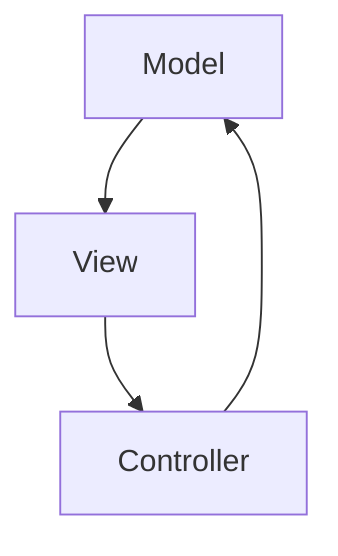

Flappy - Rapport de projet
===
*projet pcii 2023*

[TOC]

## Introduction

Ce projet consiste à réaliser un mini-jeu inspiré du célèbre jeu mobile *Flappy Bird* dans lequel un objet (ici un ovale) se déplace le long d'une ligne brisée qui défile.
Le joueur doit régulièrement cliquer sur l'écran pour faire "sauter" l'ovale et le maintenir sur cette ligne.

*Notre interface graphique sera de cette forme*

Analyse globale
---

Pour ce faire, il faut trois fonctionnalités principales : 
- l'interface graphique avec l'ovale et la ligne brisée (présentée ci-dessus)
- le défilement automatique de la ligne brisée
- la réaction de l’ovale aux clics de l’utilisateur

*séance 1 :* traitement de deux sous fonctionnalités : 
1. création d'une fenêtre et dessin de l'ovale
2. déplacement vers le haut de l'ovale lors d'un clic

Plan de développement
---
- Liste des tâches : 
    * A : Analyse du problème
    * B : Conception, développement et test d’un fenêtre avec un ovale
    * C : Conception, développement et test du mécanisme de déplacement de l’ovale
    * D : Acquisition de compétences en Swing
    * E : Documentation du projet

Conception générale
---
L'interface graphique est structurée en trois parties selon le motif MVC (Modèle, Vue, Contrôleur) : 
- Modèle : la classe `Model.java` définit l’ensemble des données qui caractérisent l’état de l'interface (constantes/variables importantes) et des méthodes qui modifient le modèle.
- Vue : la classe `View.java` contient ce qui est relatif à l'affichage : gère la façon dont l’état du modèle est rendu visible à l’utilisateur
- Contrôleur : la classe `Controller.java` gère les modifications de l'état du modèle (il s'agit du traitement des interactions utilisateur,gestion des évènements...). C'est le lien entre l'interface et le reste du monde. Il communique avec les deux classes précédentes (pour modifier le modèle et mettre à jour l'affichage.

L'implémentation de la première fonctionnalité (création d’une fenêtre et dessin de l’ovale) s'est faite dans `View.java`.

Pour la seconde fonctionnalité (déplacement vers le haut de l’ovale lors d’un clic), les méthodes et variables de modification de position (saut) ont été intégrées à `Model.java`. Les méthodes relatives à la gestion d'évènements (détéction du clic) sont dans `Controller.java`.

Conception détaillée
---

Résultat
---

Cf. copie d'écran intro

Documentation utilisateur
---
* Prérequis : Java avec un IDE (ou Java tout seul si vous avez fait un export en .jar exécutable)
* Mode d’emploi (cas IDE) : Importez le projet dans votre IDE, sélectionnez la classe Main à la racine du projet puis « Run as Java Application ». Cliquez sur la fenêtre pour faire monter l’ovale.
* Mode d’emploi (cas .jar exécutable) : double-cliquez sur l’icône du fichier .jar. Cliquez sur la fenêtre pour faire monter l’ovale.

Documentation développeur
---

Conclusion et perspectives
---
